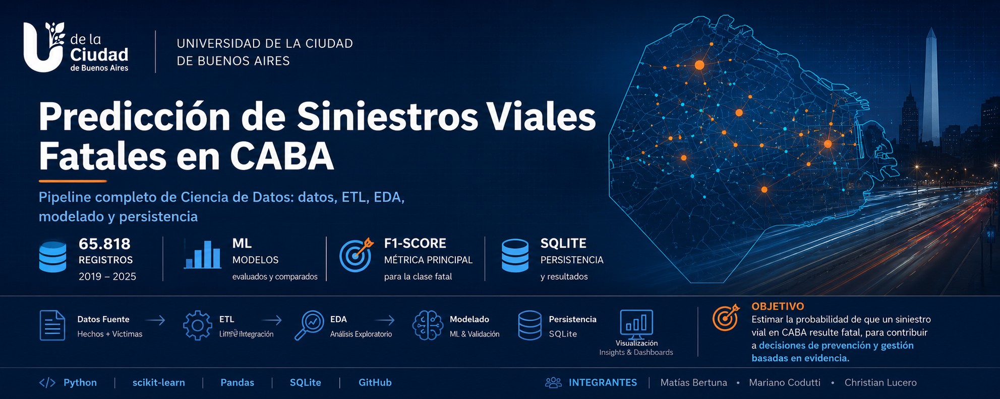

<p align="center">
  
</p>

<p align="center">


</p>

---

## Presentación web

La presentación web ofrece una síntesis del proyecto, la metodología aplicada y los resultados obtenidos.

**[Ver presentación web](https://christianishere.github.io/siniestros-viales-caba/)**

---

## Presentación del Proyecto

El presente trabajo tiene como objetivo desarrollar un modelo de Machine Learning capaz de estimar la probabilidad de que un siniestro vial registrado en la Ciudad Autónoma de Buenos Aires resulte fatal.

Para ello se utilizaron datasets públicos publicados por el Gobierno de la Ciudad de Buenos Aires, integrando información de siniestros y víctimas, aplicando procesos de preparación de datos, análisis exploratorio, modelado predictivo y persistencia en base de datos.

El proyecto fue desarrollado utilizando Python y la biblioteca scikit-learn, siguiendo una metodología incremental compuesta por las etapas de comprensión de datos, ETL, análisis exploratorio, modelado predictivo y almacenamiento de resultados.

### Flujo general del proyecto


---

## Objetivo

Construir un modelo predictivo que permita clasificar siniestros viales según la probabilidad de registrar víctimas fatales, identificando patrones relevantes asociados a variables temporales, geográficas y características de los participantes involucrados.

---

## Dataset utilizado

Fuente oficial:

* Dataset de Víctimas de Siniestros Viales del Gobierno de la Ciudad de Buenos Aires.
* Dataset complementario de Hechos de Siniestros Viales.

Además del dataset de víctimas referenciado en la consigna, se incorporó un segundo dataset de hechos de siniestros viales obtenido del portal de Datos Abiertos de la Ciudad de Buenos Aires. Esta integración permitió enriquecer el análisis incorporando variables temporales, espaciales y características del siniestro no disponibles en la fuente original.

Período analizado:

* 2019 – 2025

Tablas utilizadas:

### HECHOS

Contiene información asociada al siniestro:

* fecha y hora;
* ubicación geográfica;
* comuna;
* participantes;
* contraparte;
* gravedad del hecho.

### VÍCTIMAS

Contiene información asociada a cada víctima:

* edad;
* sexo;
* rol;
* gravedad;
* fecha de fallecimiento.

Ambas tablas se integran mediante el identificador:

```text
id_siniestro
```

---

## Metodología

El proyecto fue desarrollado en las siguientes fases:

### Fase 1 – Comprensión de los datos

* Exploración inicial de datasets.
* Revisión de diccionarios de datos.
* Identificación de relaciones entre tablas.
* Definición de la unidad de análisis.

### Fase 2 – ETL y preparación de datos

* Integración de tablas.
* Limpieza y transformación de variables.
* Construcción de la variable objetivo.
* Generación del dataset analítico.

### Fase 3 – Análisis Exploratorio de Datos (EDA)

* Análisis de distribución de la variable objetivo.
* Estudio de patrones temporales.
* Estudio de patrones geográficos.
* Evaluación de participantes y contrapartes.
* Identificación de variables potencialmente predictivas.

### Fase 4 – Modelado Predictivo

Modelos evaluados:

* Dummy Classifier
* Logistic Regression
* Decision Tree
* Random Forest

Se implementaron:

* Pipelines de preprocesamiento.
* One Hot Encoding.
* Imputación de valores faltantes.
* Ajuste de hiperparámetros mediante GridSearchCV.

### Fase 4B – Modelado Avanzado Experimental

Se evaluaron alternativas para problemas con clases altamente desbalanceadas:

* Balanced Random Forest
* SMOTE + Random Forest
* XGBoost

Además, se incorporó una etapa de Feature Engineering temporal mediante:

* franja_horaria
* tipo_dia

Los resultados mostraron mejoras consistentes respecto al modelo base, manteniendo interpretabilidad y trazabilidad metodológica.

### Fase 5 – Persistencia y Base de Datos

Se implementó una base de datos SQLite para almacenar:

* dataset preparado para modelado;
* resultados de evaluación;
* predicciones del modelo final.

---

## Variable objetivo

Se construyó la variable binaria:

```text
siniestro_fatal
```

Donde:

* 1 = existe al menos una víctima fatal.
* 0 = no existen víctimas fatales.

Distribución observada:

| Clase    | Registros |
| -------- | --------: |
| No fatal |    65.129 |
| Fatal    |       689 |

Se trata de un problema con fuerte desbalance de clases.

---

## Modelo seleccionado

El modelo final seleccionado fue un **Random Forest optimizado** mediante ajuste de hiperparámetros y enriquecido con variables temporales derivadas a partir de una etapa de Feature Engineering.

Variables derivadas incorporadas:

* franja_horaria
* tipo_dia

Métrica principal utilizada:

```text
F1-Score de la clase fatal
```

Debido al fuerte desbalance existente en el dataset.

---

## Principales resultados

* Se analizaron 65.818 siniestros viales registrados en la Ciudad Autónoma de Buenos Aires entre 2019 y 2025.
* Se construyó un pipeline completo de Ciencia de Datos, desde la adquisición y preparación de datos hasta la persistencia de resultados en base de datos.
* Se evaluaron múltiples algoritmos de Machine Learning para la predicción de siniestros fatales.
* El modelo final seleccionado fue un Random Forest optimizado y enriquecido mediante Feature Engineering temporal.
* La métrica principal utilizada fue el F1-Score de la clase fatal debido al fuerte desbalance presente en el problema.

---

## Estructura del repositorio

```text
TP_SINIESTROS_VIALES/
│
├── data_processed/
├── data_raw/
├── database/
├── docs/
│   ├── img/
│   └── index.html
├── notebooks/
│   ├── 01_exploracion_datasets.ipynb
│   ├── 02_etl_dataset_modelado.ipynb
│   ├── 03_eda.ipynb
│   ├── 04_modelado.ipynb
│   ├── 05_modelado_avanzado_experimental.ipynb
│   └── 06_base_datos.ipynb
│
├── src/
├── README.md
└── requirements.txt
```

---

## Base de datos

La solución de persistencia fue implementada mediante SQLite.

Tablas principales:

### siniestros_modelado

Dataset consolidado utilizado para modelado.

### resultados_modelos

Comparación de modelos y métricas obtenidas.

### predicciones_modelo_final

Predicciones generadas por el modelo seleccionado.

---

## Tecnologías utilizadas

* Python
* Pandas
* NumPy
* Scikit-learn
* Imbalanced-learn
* XGBoost
* Matplotlib
* Seaborn
* SQLite
* Jupyter Notebook
* Git
* GitHub

---

## Reproducción del proyecto

### 1. Clonar repositorio

```bash
git clone https://github.com/christianishere/siniestros-viales-caba.git
```

### 2. Crear entorno virtual

```bash
python -m venv .venv
```

### 3. Activar entorno

Windows:

```bash
.venv\Scripts\activate
```

Linux / Mac:

```bash
source .venv/bin/activate
```

### 4. Instalar dependencias

```bash
pip install -r requirements.txt
```

### 5. Ejecutar notebooks en orden

```text
01_exploracion_datasets.ipynb
02_etl_dataset_modelado.ipynb
03_eda.ipynb
04_modelado.ipynb
05_modelado_avanzado_experimental.ipynb
06_base_datos.ipynb
```

---

## Limitaciones

* Fuerte desbalance entre clases.
* Variables limitadas a la información disponible en los datasets públicos.
* No se incorporaron factores externos como clima, infraestructura vial, estado de la calzada o flujo de tránsito.
* Los resultados deben interpretarse como una herramienta de apoyo analítico y no como un sistema de decisión operativa.

---

## Trabajo futuro

* Incorporación de variables externas, como clima, tránsito, infraestructura vial o condiciones del entorno.
* Profundización del análisis geoespacial mediante zonas, corredores viales o cercanía a puntos críticos.
* Evaluación de nuevas estrategias para problemas con clases altamente desbalanceadas.
* Integración con herramientas de visualización y monitoreo para explorar resultados de forma dinámica.

---

## Licencia

Proyecto desarrollado con fines académicos para la asignatura Programación Avanzada para Ciencia de Datos.

Los datasets utilizados pertenecen al portal de Datos Abiertos del Gobierno de la Ciudad Autónoma de Buenos Aires.
